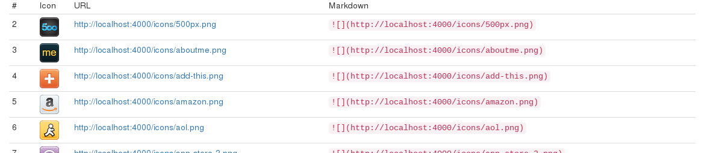

IconShowcase
============
A simple Jekyll-Application to showcase your icons.

Usage
=====
* Set `url` in `_config.yml` to your serve-url
* Put your icons inside `icons/`
* Run `jekyll build`
* Move `_site` somewhere

Screenshot
==========

